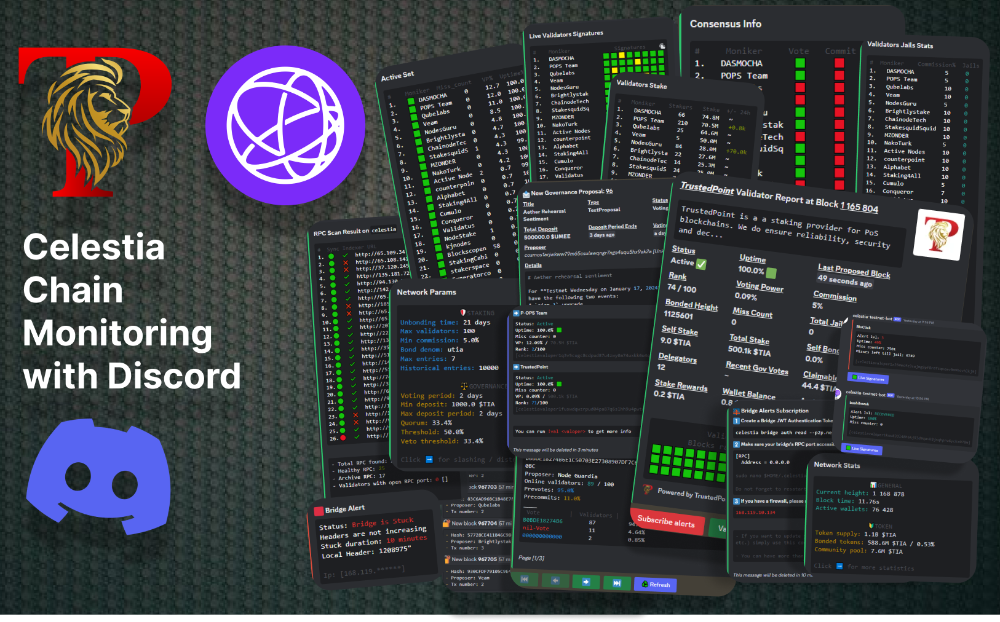

     

---

 

     

 

- Our bot serves as a vital tool for Celestia network participants, offering comprehensive insights into the network's dynamics, validators, governance proceedings, upcoming upgrades, emergency alerts, and key metrics.

- Alert Services: For validators and stakeholders, the bot provides subscription services for timely alerts. Users receive notifications about critical events such as block skipping, validator exclusion from an active set, commission adjustments, and more.

- Real-Time Block Streaming: The bot supports real-time streaming of newly produced blocks to a particular channel, enabling users to stay updated on network activities instantly.

- Validator Metrics: Users can easily find reliable validators to stake tokens through the bot's detailed metrics. These metrics include governance participation, total number of slashes, number of delegators, uptime, voting power, and more.

- Our bot can also perform an on-chain RPC and persistent peers scanning.

 

     

 

- `!rpc`: Onchain RPC scanning
- `!peers`: Onchain peers scanning

- `!val <valoper>`: Key validator metrics + real-time blocks signing
- `!vals`: Uptime + VP %
- `!vals_stake`: Number of delegators + stake + 24-h stake changes
- `!vals_slash`: Total number of slashes of each validator + commission %
- `!cons`: Consensus info (Use during upgrades)
- `!vals_all`: All validators including bonded, unbonded, unbonding
- `!vals_live`: Real-Time validators signatures
- `!self`: Check all validators that you are subscribing without providing a valoper

- `!sub_bridge`: Subscribe bridge alerts
- `!subs_bridge`: Check you current bridge subscription/s
- `!unsub_bridge`: Unubscribe all bridge alerts
- `!self_bridge`: To quickly check bridges you are subscribing

- `!chain`: Useful chain metrics
- `!params`: Network parameters + binary/tendermint/SDK versions
- `!upgrade`: Current upgrade plan. The bot automatically announces new upgrades. You can subscribe to receive a reminder 100 blocks before the upgrade height. You can manually check the current upgrade plan and subscribe to reminders.

- The bot automatically announces new governance proposals. You can view the current voting status & validator votes as well as subscribe to receive a ping once a new proposal is out (All by clicking buttons under the bot's announcement). You can also check details of the given proposal manually.
- `!props`: All proposals & ids of the active ones
- `!prop <id>`: Proposal info
- `!prop_res <id>`: Proposal expected result
- `!prop_votes <id>`: Active validators votes

- `!subs`: Check your validators alerts subscriptions
- `!sub <valoper>`: Subscribe validator alerts
- `!unsub <valoper>`: Unsubscribe validator alerts
- `!unsub_all`: Unsubscribe all validators
- `!self`: Check all validators that you are subscribing without providing a valoper
- Manual subscription to governance announcements
- `!sub_gov`: Subscribe governance announcements
- `!unsub_gov`: Unsubscribe governance announcements

- `!feedback`: Leave us feedback / Report a bug
- `!help`: All available commands with description

 

     

 

- Level one:   <95% (mocha: 90%)
- Level two:   <87% (mocha: 75%)
- Level three: <79% (mocha: 50%)
- Recovering
- Recovered
- Commission change
- Moniker change
- Dropping out of the active set
- Joining the active set
  
 

     

 

- Out of sync: when bridge's local height is 500 headers below the glogal ones 
- Stuck: when bridge's local height is stuck for > 10 minutes
- Down: when bridge's RPC port is unreachable for > 10 minutes
